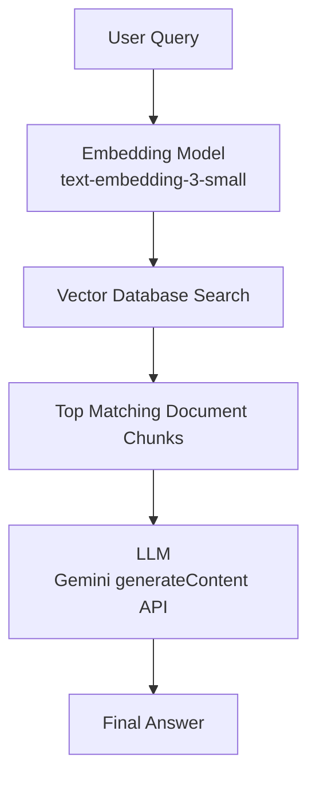

# Nurse AI Backend

Node.js API and static frontend for a nursing AI chatbot.

## Features

- `GET /health` for service health checks
- `POST /api/chat` for chatbot responses
- `POST /api/embeddings` for embedding generation
- `POST /api/chat/retrieval` for retrieval-augmented chatbot responses
- Nursing-specific system prompt with a fixed response format
- Basic request validation and emergency-safety language
- Local JSON vector store ingestion for nursing notes
- Static frontend served from `frontend/index.html`

## Requirements

- Node.js 18 or newer
- A `GEMINI_API_KEY`
- Optional: an `OPENAI_API_KEY` only if `CHAT_PROVIDER=openai` or `EMBEDDING_PROVIDER=openai`

## Setup

1. Copy `backend/.env.example` to `backend/.env`
2. Fill in your Gemini API key
3. Use Gemini for chat and note embeddings:

```bash
CHAT_PROVIDER=gemini
GEMINI_CHAT_MODEL=gemini-2.5-flash
EMBEDDING_PROVIDER=gemini
GEMINI_API_KEY=your_gemini_api_key_here
GEMINI_EMBEDDING_MODEL=gemini-embedding-001
```

4. Start the server:

```bash
cd backend
npm start
```

The app runs on `http://localhost:3001` by default.

## Build The Knowledge Base

1. Put your nursing source text in:

```text
database/source/nursing-notes.txt
```

2. Generate chunks and embeddings:

```bash
cd backend
npm run build:vectors
```

This creates:

```text
database/vector-store/nursing-embeddings.json
```

## Architecture

See the system flow diagram and notes in [docs/architecture.md](C:\Users\user\Desktop\AI assistant\nurse-ai\docs\architecture.md).



## API

### `GET /health`

Response:

```json
{
  "status": "ok"
}
```

### `POST /api/chat`

Request body:

```json
{
  "message": "What is hypertension?"
}
```

Response:

```json
{
  "reply": "Definition\n..."
}
```

### `POST /api/embeddings`

Request body:

```json
{
  "text": "Hypertension management in older adults",
  "metadata": {
    "source": "NEUROLOGICAL NURSING-3.pdf",
    "topic": "Neurological nursing"
  }
}
```

Response:

```json
{
  "model": "text-embedding-3-small",
  "text": "Hypertension management in older adults",
  "embedding": [0.01, -0.02],
  "metadata": {
    "source": "NEUROLOGICAL NURSING-3.pdf",
    "topic": "Neurological nursing"
  }
}
```

### `POST /api/chat/retrieval`

Request body:

```json
{
  "message": "What is meningitis?",
  "topK": 3
}
```

Response:

```json
{
  "reply": "Definition\n...",
  "matches": [
    {
      "id": "chunk-1",
      "title": "Meningitis",
      "score": 0.87,
      "metadata": {
        "source": "nursing-notes.txt",
        "topic": "MENINGITIS"
      }
    }
  ]
}
```
