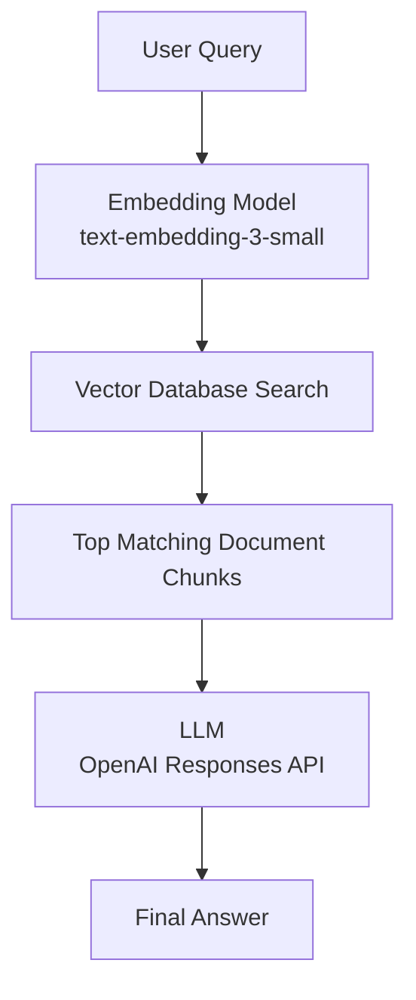

# Nurse AI Architecture

## RAG Flow

## How It Works

1. The client sends a question to the backend retrieval endpoint.
2. The backend converts the question into an embedding vector.
3. The vector store compares that query vector with stored nursing note embeddings.
4. The top matching chunks are selected as grounding context.
5. The LLM generates the final answer using the required nursing response structure.

## Project Mapping

- Retrieval endpoint: `POST /api/chat/retrieval`
- Embedding model: `text-embedding-3-small`
- Vector search logic: `backend/src/vectorStore.js`
- Embedding builder: `backend/scripts/buildVectorStore.js`
- Stored vectors: `database/vector-store/nursing-embeddings.json`
- LLM response generation: `backend/src/openaiClient.js`
- Nursing answer format: `backend/src/nursePrompt.js`
